## Классы. Отношения между классами

## Пакеты в Java


---

## Класс и объект

В объектно-ориентированном программировании классы и объекты не существуют изолированно. 

Они взаимодействуют друг с другом, образуя различные типы отношений.  

Понимание этих отношений критически важно для создания хорошо структурированных и поддерживаемых программ.

---

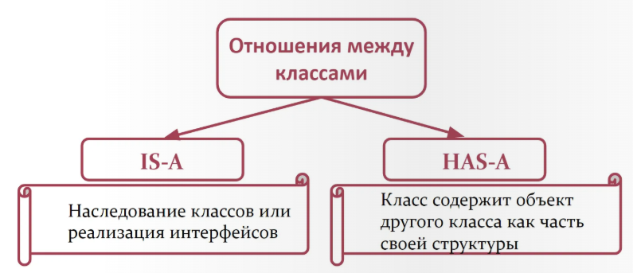

---
layout: two-cols
---

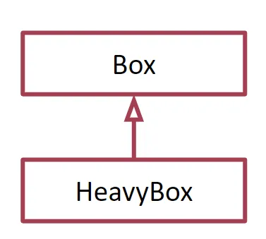

В ООП принцип IS-A основан на **наследовании классов** или **реализации интерфейсов**.

::right::

Например, если класс `HeavyBox` наследует `Box`, мы говорим, что `HeavyBox` является `Box` (`HeavyBox` IS-A `Box`):

```java
class Box {
   private double width;
   private double height;
   private double depth;
   …
}

class HeavyBox extends Box {
   private int weight;
   …
}
```

---
layout: two-cols
---

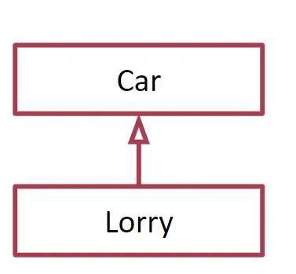


::right::

класс `Lorry` расширяет класс `Car`:

```java
class Car {
  ...
}

class Lorry extends Car {
   ...
}
```

В этом случае `Lorry` IS-A `Car`.
---
layout: two-cols
---

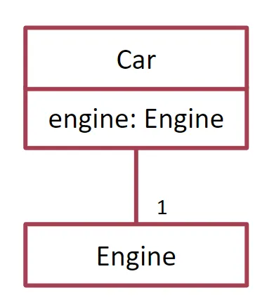

::right::

**HAS-A** отношения основаны на использовании.

Например, класс `Car` содержит переменную типа `Engine`:

```java
class Car {
  Engine engine;
   ...
}

class Engine {
   ...
}
```

Мы говорим `Car` HAS-A `Engine`.

---
layout: two-cols
---

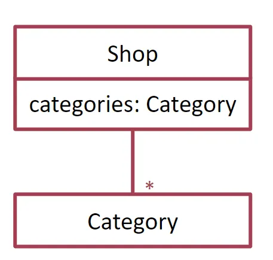

::right::

Или `Shop` содержит массив `Category`:

```java
class Shop {
  Category [] categories;
   ...
}

class Category {
   ...
}
```

`Shop` HAS-A `Category`.

---
layout: default
---

- ## Ассоциация

- ## Агрегация

- ## Композиция

---

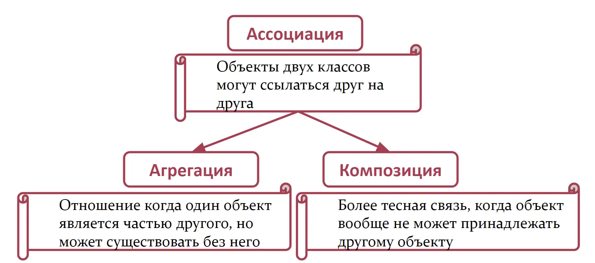
---
layout: two-cols
---

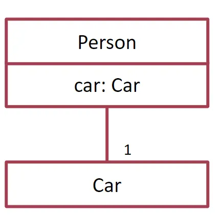
::right::

В этих отношениях объекты двух классов могут ссылаться друг на друга. 

**Ассоциация** может быть односторонней или двусторонней.

```java
class Person {
   private String name;
   private Car car;
   ...
}

class Car {
   ...
}
```

 Класс `Person` содержит переменную `Car`, в этом случае мы можем говорить, что есть ассоциация между классом `Person` и `Car`.

---
layout: two-cols
---


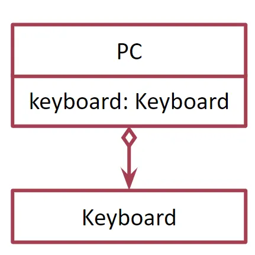

::right::

**Агрегация** - отношение когда один объект является частью другого. 

```java
public class PC {
    private Keyboard keyboard;

    public PC (Keyboard keyboard) {
        this.keyboard = keyboard;
    }
}
```

Объект `Keyboard` создаётся отдельно и передаётся в `PC`. 

Если `PC` удаляется, `Keyboard` продолжает существовать самостоятельно.

---
layout: two-cols
---


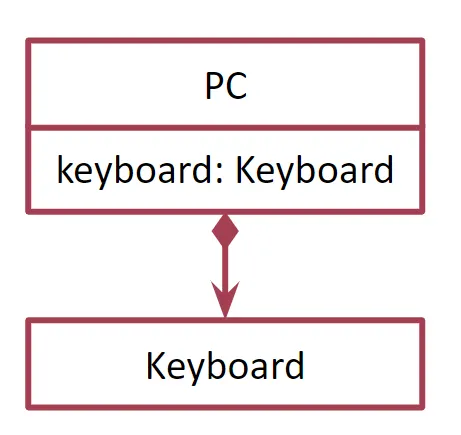

::right::

**Композиция** - еще более тесная связь, когда объект не только является частью другого объекта, но и вообще не может принадлежать другому объекту

```java
public class PC {
    private Keyboard keyboard;

    public PC () {
        this.keyboard = new Keyboard();
    }
}
```

В конструкторе `PC` создаётся собственный объект `Keyboard`. 

Такой объект неотделим от `PC` и не существует без него - это композиция.

---
layout: default
---

##### Ассоциация
- Общая связь между двумя классами.  
- Один объект **использует** другой.  
- Жизненный цикл не связан.  
- Пример: `Учитель` ↔ `Школа`.

##### Агрегация
- Частный случай ассоциации («has-a»).  
- Один объект **состоит из** других, но они могут существовать сами по себе.  
- Слабая связь (пустой ромб в UML).  
- Пример: `Кафедра` - включает `Преподавателей`.

##### Композиция
- Более сильная форма агрегации.  
- Жизненный цикл зависим: если «владелец» уничтожен, то и части тоже.  
- Сильная связь (закрашенный ромб в UML).  
- Пример: `Дом` - состоит из `Комнат`.
---


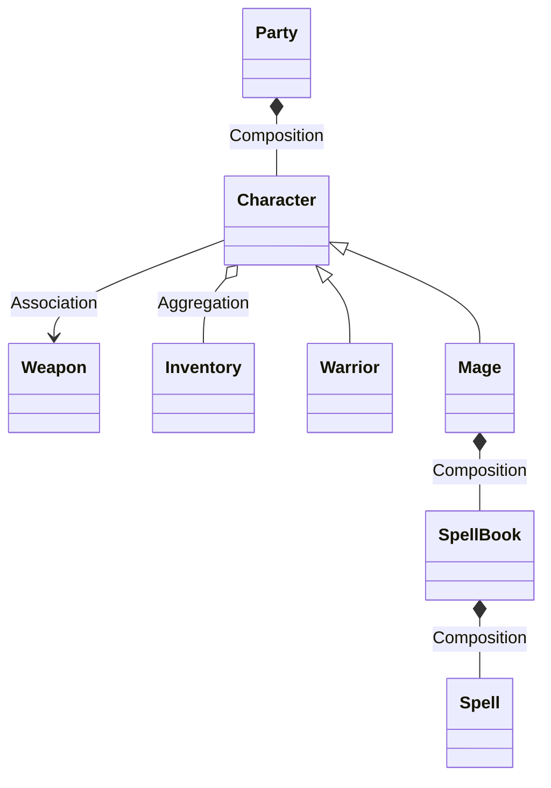
---
layout: two-cols
layoutClass: gap-2
---

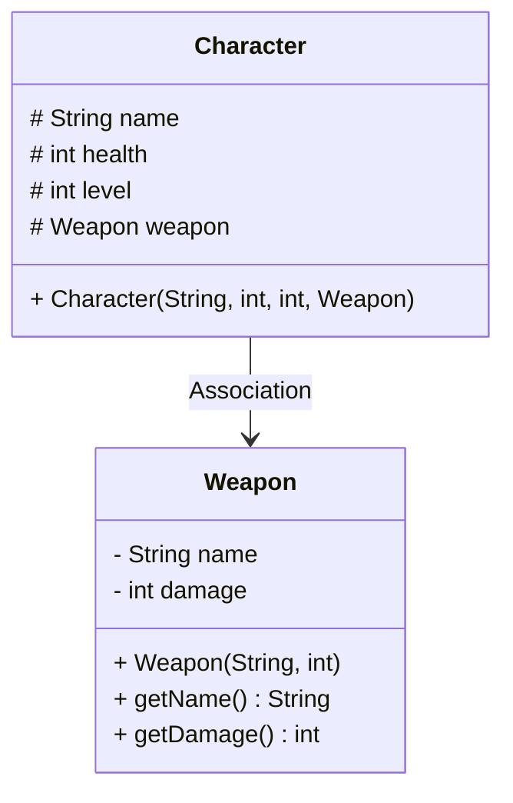

::right::

- `Character` ассоциирован с `Weapon` (имеет ссылку на него).

- Поля `name`, `health`, `level` защищённые (`protected`).

- У `Weapon` есть свои геттеры.

---
layout: two-cols
layoutClass: gap-2
---

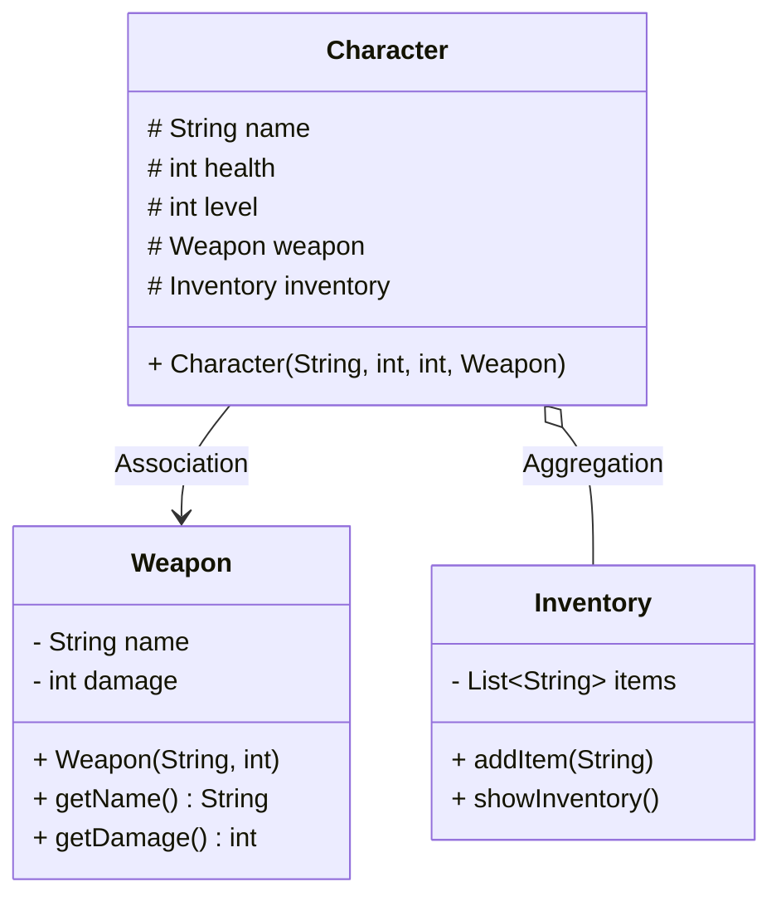

::right::

  `Character` ассоциирован с `Weapon` (персонаж использует оружие). 

Ассоциация указывает на наличие ссылки, но не на владение жизненным циклом.
_________

`Character` агрегирует `Inventory` (персонаж имеет инвентарь). 

Агрегация демонстрирует более слабую связь: инвентарь может существовать независимо от персонажа и использоваться повторно.

---
layout: two-cols
layoutClass: gap-2
---

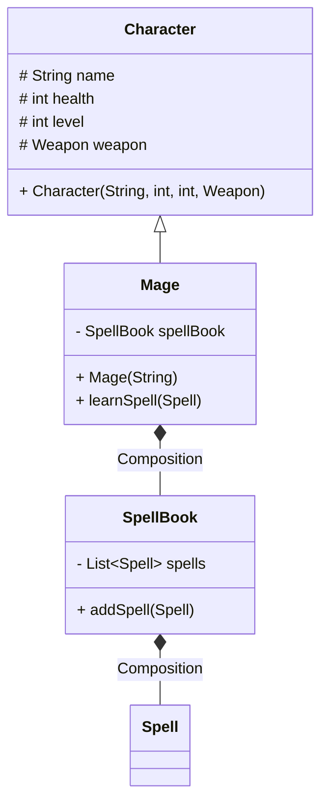

::right::

Класс `Mage` наследует `Character`, расширяя его функциональность.

___
Между `Mage` и `SpellBook` реализована композиция: книга заклинаний создаётся вместе с магом и не может существовать без него.

___

Класс `SpellBook` в свою очередь композицией связан с `Spell`: заклинания составляют неотъемлемую часть книги.

---
layout: two-cols
layoutClass: gap-2
---

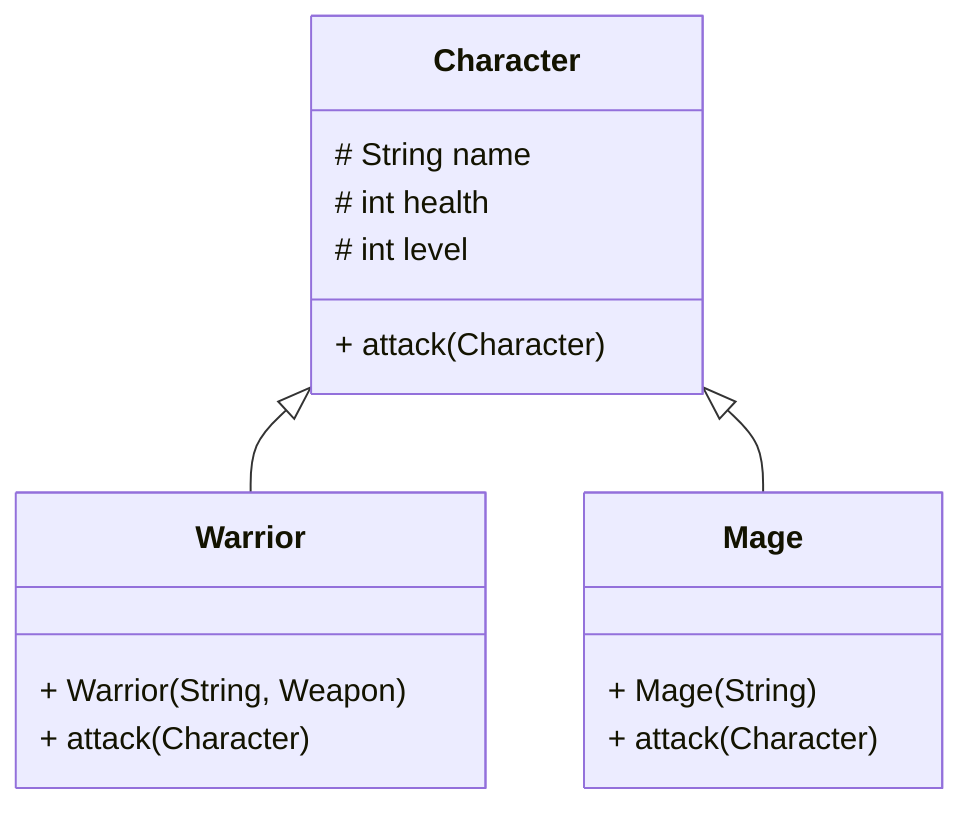

::right::

Наследование в Java отражает отношение **IS-A** («является»).
___
Классы `Warrior` и `Mage` наследуют базовый класс `Character`, получая его поля и методы.
___
При этом они переопределяют метод `attack()`, реализуя собственное поведение.

---

### Класс `Object`

В Java каждый класс является потомком класса `Object`.  

Даже если вы явно не пишете `extends Object`, компилятор автоматически это сделает.

Таким образом, класс `Object` — это корень иерархии классов Java.

#### Уникальность класса Object
1. Это **единственный класс без родителя**.  
2. Все классы наследуют его методы.
---

## Методы класса `Object`

Любой объект в Java уже умеет:  
- сравниваться (**equals**)  
- генерировать числовой идентификатор (**hashCode**)  
- превращаться в строку (**toString**)  
- быть клонированным (**clone**)  
- участвовать в синхронизации (**wait**, **notify**, **notifyAll**)

---

## Метод `toString()`
В `Object` он реализован так:
```java
public String toString() {
    return getClass().getName() + "@" + Integer.toHexString(hashCode());
}
```

По умолчанию результат выглядит так:
```java
java.lang.Object@5e2de80c
```

---

Главная ценность метода - его **переопределение**. 

Разработчик может вернуть более удобное описание объекта.

```java
class Student {
    private String name;
    private int age;

    public Student(String name, int age) {
        this.name = name;
        this.age = age;
    }

    @Override
    public String toString() {
        return "Student{name='" + name + "', age=" + age + "}";
    }
}

public class Demo {
    public static void main(String[] args) {
        Student st = new Student("Arthur", 18);
        System.out.println("Student is " + st);
    }
}
```

---

## Методы `equals()` и `hashCode()`

По умолчанию `equals()` из `Object` работает так:
```java
public boolean equals(Object obj) {
    return (this == obj);
}
```

То есть он сравнивает ссылки **на объекты**, а не содержимое.

---

Чтобы сравнивать содержимое объектов, метод нужно **переопределить**.

```java
class Fraction {
    ...

    @Override
    public boolean equals(Object obj) {
        if (obj == null) return false;
        if (this.getClass() != obj.getClass()) return false;
        Fraction other = (Fraction) obj;
        return this.numerator * other.denominator ==
               this.denominator * other.numerator;
    }
}

public class Demo {
    public static void main(String[] args) {
        Fraction one = new Fraction(2, 3);
        Fraction two = new Fraction(4, 6);
        System.out.println(one.equals(two)); // true
    }
}
```

---

## Метод `hashCode()`

Возвращает целое число, связанное с объектом.

Используется коллекциями (`HashSet`, `HashMap`) для быстрого поиска.

Ключевые свойства:
- Если `equals()` возвращает `true` → `hashCode()` должен совпадать.

- Разные объекты могут иметь одинаковый `hashCode` (коллизии допустимы).

- Хорошая реализация равномерно распределяет объекты.

---

## Метод `getClass()`

- Возвращает объект **`Class`**, описывающий текущий объект.  
- Используется для получения метаинформации: имя класса, поля, методы, конструкторы.  

**Пример:**  
```java
Student st = new Student("Arthur", 18);
System.out.println(st.getClass().getName());
// Вывод: Student
```

---

## Пакеты в Java

- Появились с самого начала.

- Реализуют пространство имён.

- Позволяют использовать классы с одинаковыми именами.

- Структурируют код в больших проектах.

- Ограничивают доступ к классам и методам.

---

## Структура пакета

Пример папок:
```java
src/
└── com/example/app/
    └── MyFirstApp.java
```

Объявление пакета:
```java
package com.example.app;
```

Без этого объявления класс окажется в безымянном пакете (`unnamed package`)

---

```java
package com.example.app;

public class MyFirstApp {
    public static void main(String[] args) {
        System.out.println("I am learning Java!");
        System.out.println("I am a programmer.");
    }
}
```

---

## Примеры стандартных пакетов

- `java.io` — ввод-вывод

- `java.math` — математика

- `java.time` — работа с датами и временем

- `java.util` — коллекции

---

## Зачем нужны пакеты

1. Структурирование проекта
    ```java
      com.example.app.exception
      com.example.app.sql
      com.example.app.storage.serializer
      ```
2. Ограничение доступа (package-private).
3. Одинаковые имена классов не конфликтуют:
   - `java.util.Date`
   - `java.sql.Date`
 
---

## Правила создания пакетов

- Начинаются с реверсивного доменного имени (`com.example`).

- Только строчные буквы.

- **1** файл → **1** пакет.

- Подпапки должны соответствовать имени пакета.

---

## Импорт классов

```java
import java.util.Scanner;
Scanner console = new Scanner(System.in);
```

**Способы:**

- Конкретный класс: `import java.util.Arrays`;

- Статический: `import static java.lang.Math.max`;

- Весь пакет: `import java.util.*`;

**Особенности:**

- Внутри пакета импорт не нужен.

- `java.lang` импортируется автоматически.

- Подпакеты импортируются явно (java.util.concurrent).

---

## Компиляция и запуск проектов с пакетами

**Компиляция для одного файла**:

```bash
javac -d out/ src/com/example/app/MyFirstApp.java
```

**Компиляция для проекта**:

```bash
javac -d out/ -sourcepath src/ src/com/example/app/MyFirstApp.java
```

**Запуск**:

```bash
java -cp out/ com.example.app.MyFirstApp
```


---

## Пример проекта с пакетами

```java
src/
└── game/
    ├── characters/
    │   ├── Character.java
    │   ├── Warrior.java
    │   └── Mage.java
    ├── inventory/
    │   ├── Inventory.java
    │   └── Weapon.java
    ├── spells/
    │   ├── Spell.java
    │   └── SpellBook.java
    ├── party/
    │   └── Party.java
    └── Main.java

```

---

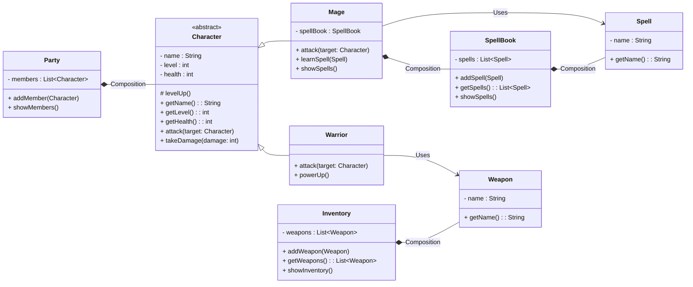

---

```txt
В книгу заклинаний добавлено: Огненный шар
В книгу заклинаний добавлено: Молния
Известные заклинания:
 - Огненный шар
 - Молния
Добавлено оружие: Orcrist
Добавлено оружие: Посох Света
Инвентарь:
 - Оружие: Orcrist
 - Оружие: Посох Света
Thorin присоединился к партии!
Gandalf присоединился к партии!
Партия состоит из:
 - Thorin (HP: 120, Level: 1)
 - Gandalf (HP: 80, Level: 10)

=== Начало битвы! ===
Thorin атакует мечом Gandalf и наносит 17 урона!
...
Gandalf получил 19 урона. Осталось HP: 44
Партия состоит из:
 - Thorin (HP: 70, Level: 2)
 - Gandalf (HP: 44, Level: 10)
```